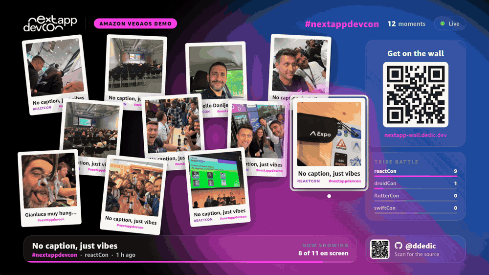
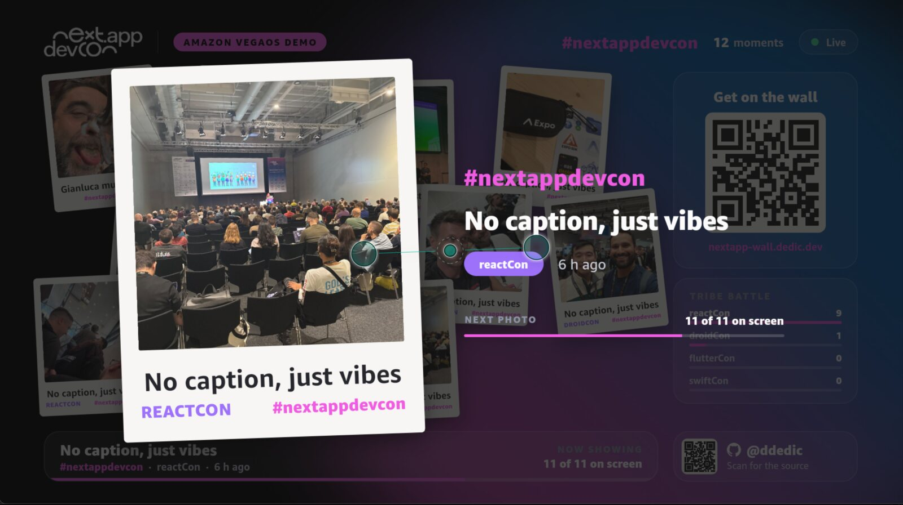
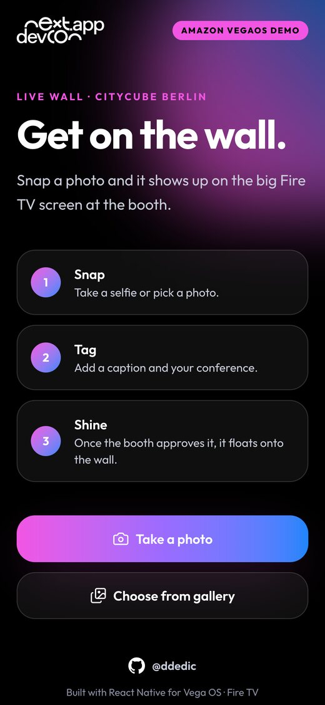
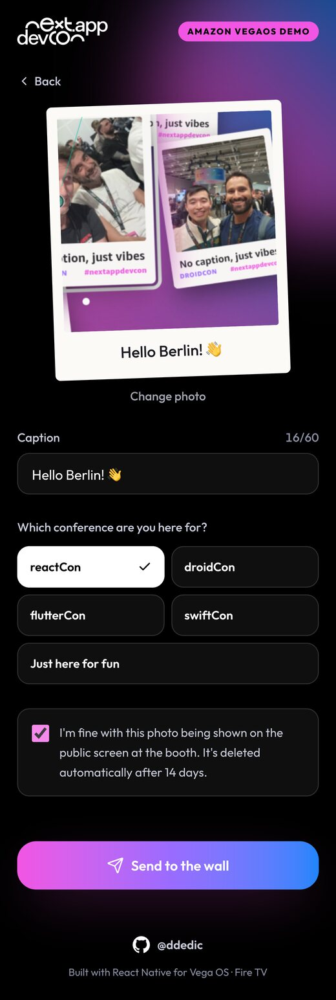
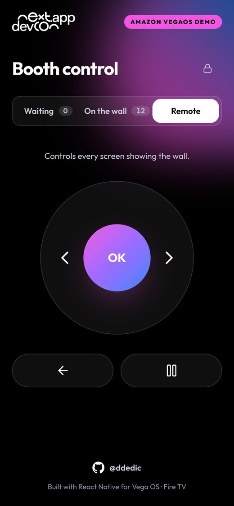

# Live Wall

**A realtime photo wall for a conference booth, running on a Fire TV with Amazon Vega OS.**
Attendees scan a QR code, snap a photo on their phone, the booth approves it, and it floats onto the TV a second later.

An Amazon Vega OS demo by [@ddedic](https://github.com/ddedic), built for next.app devCon 2026 in Berlin.


[](https://github.com/ddedic/nextappdevcon-amazon-vegaos-wall/actions/workflows/ci.yml)




## Try it

- Open **https://nextapp-wall.dedic.dev** on your phone. That's the page the QR code on the TV points to.
- Send a photo. It lands in the booth's approval queue, and once approved it shows up on every TV running the wall.
- The TV app is in [`apps/tv`](apps/tv). It runs in Amazon's Vega Virtual Device on a Mac, or on a real Fire TV Stick (see [Getting started](#getting-started)).
- Have a Vega OS Fire TV, or the Vega Virtual Device on a Mac? Grab the ready-made `.vpkg` from the [latest release](https://github.com/ddedic/nextappdevcon-amazon-vegaos-wall/releases/latest).

## What's interesting in here

- **React Native on a TV, done properly.** Remote control with D-pad and OK, a kiosk-safe Back button, a 960×540 layout canvas, and every animation on the native driver so it stays smooth on a Fire TV Stick.
- **A tested state machine runs the show.** Auto-advance, a slideshow spotlight, new arrivals that announce themselves and politely hurry the current photo, a full-screen moment every 20 seconds. All of it is one pure reducer with unit tests, not a pile of timers.
- **Realtime on the edge for almost nothing.** A Hono API on Cloudflare Workers, photos in R2, rows in D1, and a single hibernating Durable Object that pushes events to every TV over WebSockets.
- **Two remotes for the booth.** A phone remote that travels through the same WebSocket, and a laptop remote that presses real keys on the device through Vega's `inputd-cli`.
- **Privacy by default.** Approve-first moderation, explicit consent, uploaders can delete their own photo, a 14-day auto-delete, and no raw IP addresses stored.
- **One typed contract.** zod schemas in `packages/shared` validate the same payloads on the phone, the API and the TV.

## Building for Vega OS yourself?

[docs/vega-os-notes.md](docs/vega-os-notes.md) collects the practical gotchas I hit along the way: the build command, manifest traps, the 960×540 canvas, remote input, flicker-free animation, debugging with DevTools and pressing remote keys from your Mac.

## Screenshots

| Full-screen spotlight on the TV                      |
| ---------------------------------------------------- |
|  |

| Send a photo                                                                   | Caption, conference, consent                                             | Phone remote for the booth                                                              |
| ------------------------------------------------------------------------------ | ------------------------------------------------------------------------ | --------------------------------------------------------------------------------------- |
|  |  |  |

## How it works

1. Someone scans the QR code on the TV and opens the phone page.
2. They take or pick a photo, add a caption, choose their conference "tribe" and tick the consent box. The phone shrinks the image to about 1080px and uploads it.
3. The API stores the image in R2 and a row in D1 with status `pending`. Nothing reaches the TV yet.
4. Someone at the booth opens the hidden `/admin` page, enters the passcode and approves the photo.
5. The API tells the Durable Object, which pushes the event over a WebSocket to every connected TV.
6. The TV drops the new polaroid onto the wall and selects it.

The design notes and the reasons behind them are in [docs/architecture.md](docs/architecture.md).

## Tech stack

| Part             | What it uses                                                                          |
| ---------------- | ------------------------------------------------------------------------------------- |
| TV app           | React Native 0.83 for Vega OS (`@amazon-devices/react-native-kepler`), Animated API   |
| Phone + admin    | Vite, React 19, Tailwind CSS v4, served as a Cloudflare static-assets Worker          |
| API              | Hono on Cloudflare Workers, D1 with Drizzle ORM, R2, a Durable Object, a cron trigger |
| Shared contracts | zod v4 schemas in `packages/shared`, validated on both ends                           |
| Tooling          | pnpm workspaces, Turborepo, TypeScript, ESLint, Prettier, Husky, Vitest, Jest         |
| Deploys          | The `cf` CLI with `cloudflare.config.ts` per Worker                                   |

## Getting started

You need:

- Node 24 (see `.nvmrc`)
- pnpm 10
- The Vega SDK 0.24 with the Vega Virtual Device, for the TV app
- The `cf` CLI, logged in to your Cloudflare account, for local Workers dev and deploys

```sh
pnpm install
pnpm typecheck && pnpm lint && pnpm test && pnpm format:check
```

### TV app

```sh
export PATH="$HOME/vega/bin:$PATH"
pnpm tv:vvd:start        # start the Vega Virtual Device
pnpm tv:build:debug
pnpm tv:run:vvd
pnpm tv:start            # optional: Metro, for fast refresh
pnpm tv:vvd:restart:1080 # restart the Virtual Device at 1920×1080 and relaunch the app
```

For a real Fire TV Stick, build a release with `pnpm tv:build:release` and install `apps/tv/build/armv7-release/tv_armv7.vpkg` with `vega run-app`.

The API and join URLs live in `apps/tv/src/app/app.config.ts`. Set `simulation.enabled` there to run the wall on 40 generated photos without the API.

### Phone page

```sh
pnpm web:dev             # http://localhost:5173, talks to the live API by default
```

Set `VITE_API_URL` to point it at a local API instead. The admin page is at `/admin`.

### API

```sh
cp apps/api/.dev.vars.example apps/api/.dev.vars    # then set ADMIN_TOKEN
pnpm --filter @vegaos-demo/api db:migrate:local
pnpm api:dev
```

## TV remote

| Button     | What it does                                                                 |
| ---------- | ---------------------------------------------------------------------------- |
| OK         | Opens the spotlight: a full-screen slideshow that keeps advancing on its own |
| ← / →      | Steps through every approved photo, newest first, not only the 11 on screen  |
| Back       | Closes the spotlight. On the wall, press it twice to exit the app            |
| Play/Pause | Pauses or resumes auto-advance, on the wall and in the spotlight             |

Left alone, the wall moves on every 7 seconds. It shows 11 photos at a time and rotates the rest in.

### Remotes for the booth

- **Phone remote:** the **Remote** tab on `/admin`. Works with any Fire TV running the wall.
- **Laptop remote:** `pnpm remote`, then http://localhost:4400. Presses real keys through Vega's dev-mode `inputd-cli`.

## Deploying

Both Workers deploy with the `cf` CLI. Forking? Point `apps/api/cloudflare.config.ts`, `apps/web/cloudflare.config.ts` and the `db:migrate:*` scripts at your own D1, R2 and domains.

```sh
# 1. database schema
pnpm --filter @vegaos-demo/api db:migrate:remote

# 2. API. On the first deploy, upload the admin passcode with it:
pnpm --filter @vegaos-demo/api exec cf deploy --secrets-file .dev.vars
#    after that:
pnpm api:deploy

# 3. phone page
pnpm web:deploy
```

`ADMIN_TOKEN` is the booth passcode. It's a Worker secret, never committed; locally it lives in `apps/api/.dev.vars` (gitignored, see `.dev.vars.example`).

## Privacy and safety

It runs at a public event with real people's faces, so it errs on the careful side:

- **Approve first.** Nothing shows on the TV until someone at the booth approves it.
- **Consent and control.** A required consent box, a delete link for the uploader, and a 14-day auto-delete.
- **No raw IPs.** IPs are hashed with a daily salt and used only for rate limits. No accounts, no tracking.
- **Hard to abuse.** Upload caps sized for venue Wi-Fi, real-image checks, no hotlinking, private pending photos and a passcode lockout. Details in [docs/architecture.md](docs/architecture.md#abuse-protection).

## Known limitations and ideas

- One shared wall. The Durable Object uses a single room, so every TV shows the same feed.
- Admin auth is a shared passcode. Fine for one booth for three days, not for anything bigger.
- The admin page polls every 4 seconds instead of listening on the WebSocket.
- Rate limits live in D1, which is plenty for one booth. A busier deployment would put a Cloudflare rate-limiting rule in front.
- No image moderation beyond the human at the booth.
- Ideas: a per-event room id, push the pending queue to admins over the same socket instead of polling, a short highlight reel the TV can play between photos, and a Fire TV Stick build in the Appstore via Live App Testing.

## License

The code is under the [MIT License](LICENSE).

Brand assets are not covered by the MIT grant: the next.app devCon logos and artwork in `apps/tv/src/assets` and `apps/web/src/assets`, the app icon in `apps/tv/assets/image`, and the web icons in `apps/web/public`. They belong to their respective owners.

## Disclaimer

This is an independent prototype. It is not an official Amazon or next.app devCon product, and it isn't endorsed by either. Fire TV and Vega are trademarks of Amazon.com, Inc. or its affiliates. next.app devCon is organised by Mobile Seasons GmbH.
