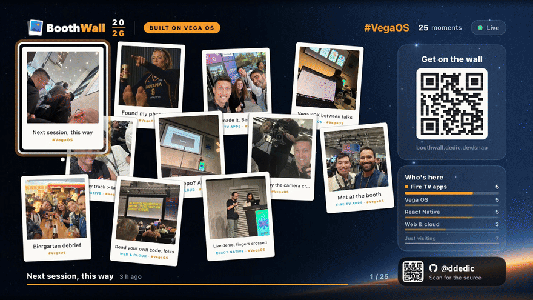
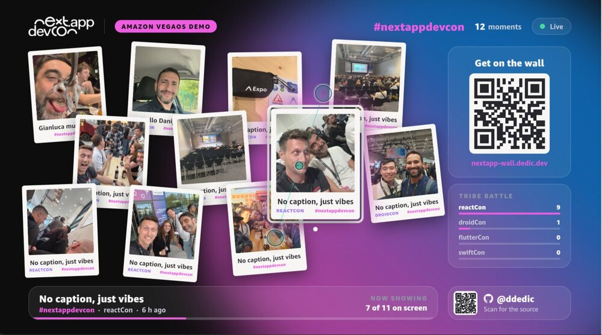
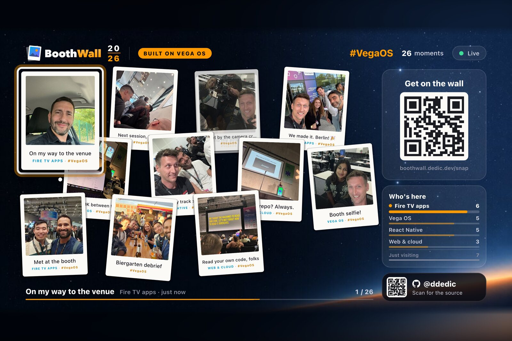
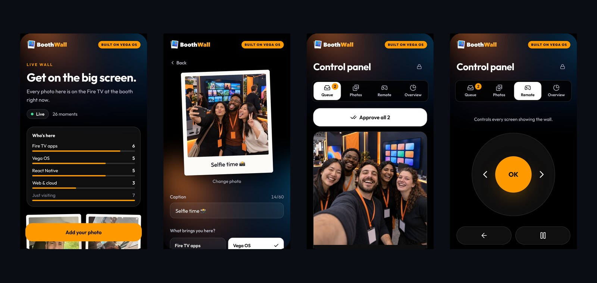

# BoothWall

**A live photo wall for event booths, running on Fire TV with Amazon Vega OS.**

Visitors scan the QR code on the TV, take a photo with their phone, someone at the booth approves it, and a second later it drops onto the wall as a polaroid. The same wall runs in any browser, so a laptop or a projector works too.

[](https://github.com/ddedic/boothwall/actions/workflows/ci.yml)




**[Open the live demo](https://boothwall.dedic.dev)** · [Make it yours](#make-it-yours) · [Vega OS field notes](docs/vega-os-notes.md) · [How it's built](docs/architecture.md)

## Where it came from

<table>
<tr>
<td width="52%">

I built the first version, then called Live Wall, for next.app devCon 2026 in Berlin: a photo wall on a Fire TV running Amazon's new Vega OS. After the event I moved everything event-specific into one config file and cleaned it up into a sample anyone can run at their own booth.

**The devCon version has its own branch,** [`devcon-2026`](https://github.com/ddedic/boothwall/tree/devcon-2026), tagged [v1.0.0](https://github.com/ddedic/boothwall/releases/tag/v1.0.0). Its branding lives on in [`examples/nextapp-devcon`](examples/nextapp-devcon).

</td>
<td>

<p align="center"><sub>Live Wall at next.app devCon 2026</sub></p>
</td>
</tr>
</table>

The photos in the screenshots below were taken at that booth, and the demo site started out with the same set. The app's offline demo mixes them with generated booth scenes.

## What you get

### A TV app built for Vega OS

Eleven polaroids drift on the wall while it steps through every approved photo. New arrivals get a badge and a moment full screen. The side panel has the QR code and a live count per category. It's driven by the D-pad, Back is kiosk-safe, and every animation runs on the native driver so it stays smooth on a Fire TV Stick.


Press OK for the spotlight, a full-screen slideshow that keeps going on its own.

### The same wall in a browser



The wall is one shared package. The TV renders it through React Native for Vega and the web app renders the same code through React Native for Web, live from the same API. Open [boothwall.dedic.dev](https://boothwall.dedic.dev) on a laptop and put it on a projector, or press F for full screen.

On a phone held upright the 16:9 wall would be a thin strip, so phones get a feed instead: the photos newest first, the category counts and a big "Add your photo" button.

### A phone page and a Control panel



Visitors upload at `/snap`, the address behind the QR code. They pick a photo, add a caption and a category, and tick the consent box. Nothing goes public until someone at the booth approves it in the Control panel at `/control`, which also manages every photo (hide, edit, delete, in bulk too), shows live numbers and works as a remote for the TV.

### A small Cloudflare backend

A Hono API on Cloudflare Workers, photos in R2, rows in D1, and one Durable Object that pushes each approval to every screen. It hibernates while nothing is happening, so a connected screen sitting idle costs nothing.

## Try it

### In your browser

No Vega SDK needed:

```sh
git clone https://github.com/ddedic/boothwall && cd boothwall
pnpm install
pnpm web:dev
```

Open http://localhost:5173. The config in the repo points at the public demo, so this is the real wall from boothwall.dedic.dev, live. Arrow keys, Enter, Space and Escape stand in for the remote. Add `?demo` to run on the bundled photos instead, `?kiosk` to hide the cursor and hints, or `?fullscreen` to go full screen on the first key press.

### On the Vega Virtual Device

You need the [Vega SDK](https://developer.amazon.com/docs/vega/) with the Virtual Device, Node 24 and pnpm 10:

```sh
export PATH="$HOME/vega/bin:$PATH"
pnpm tv:vvd:start:1080   # the Virtual Device at 1920×1080
pnpm tv:build:debug
pnpm tv:run:vvd
```

Use the Virtual Device's on-screen remote, or run `pnpm remote` for a bigger one in your browser. Scan the QR code on the screen with your phone and send a photo to the demo wall; it shows up once it's approved. To run without a network, set `demo: true` in the config and rebuild.

## Make it yours

1. **Configure.** Everything event-specific lives in [`packages/shared/src/config/boothwall.config.ts`](packages/shared/src/config/boothwall.config.ts): the event name, hashtag, categories, brand colours and where it deploys. Set `deploy.apiDomain` and `deploy.webDomain` to domains on your Cloudflare account, or to `""` for free workers.dev addresses. [docs/customising.md](docs/customising.md) explains every field.
2. **Brand it.** Swap the logo, the TV backdrop and the icons for yours, keeping the file names ([list](docs/customising.md#brand-images)). To see a fully branded wall first, run `pnpm boothwall example nextapp-devcon`.
3. **Deploy.** Run `pnpm exec cf auth login`, then `pnpm boothwall setup`. It creates the D1 database and R2 bucket in your account, sets the booth passcode, deploys the API and the web app, and writes the addresses back into the config. After that, `pnpm boothwall deploy` ships changes.
4. **Put it on the TV.** Build a release and install it on a Fire TV in developer mode, or on the Virtual Device:

   ```sh
   pnpm tv:build:release
   vega run-app apps/tv/build/armv7-release/tv_armv7.vpkg com.boothwall.app.main -d <device>
   ```

## Learn more

- [Running a booth](docs/running-a-booth.md): the TV remote, the Control panel, and privacy and safety.
- [Customising](docs/customising.md): every config field and the images to replace.
- [How it's built](docs/architecture.md): how a photo gets from a phone to the wall, and why each piece is the way it is.
- [Vega OS field notes](docs/vega-os-notes.md): the platform gotchas I hit, from build commands to memory on a Fire TV Stick.
- [Contributing](CONTRIBUTING.md): commands, running the API locally, and how the code is organised. Issues and pull requests are welcome, especially from people building for Vega OS.

## License

The code is [MIT](LICENSE). The default BoothWall artwork in `brand/` and the apps' asset folders is MIT too, including the demo photos: generated booth scenes plus the author's own photos from the next.app devCon 2026 booth.

The next.app devCon logos and artwork in [`examples/nextapp-devcon`](examples/nextapp-devcon) are **not** covered by the MIT license. They belong to their owners and are there as a worked example only.

BoothWall is an independent project by [@ddedic](https://github.com/ddedic). It isn't an official Amazon product and isn't endorsed by Amazon or next.app devCon. Fire TV and Vega are trademarks of Amazon.com, Inc. or its affiliates.
