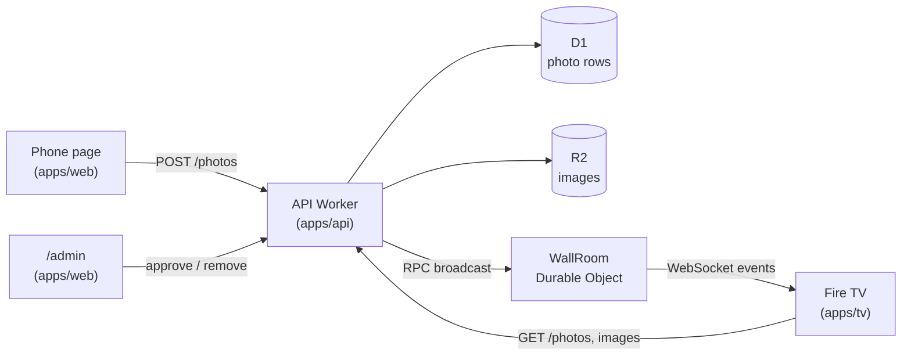
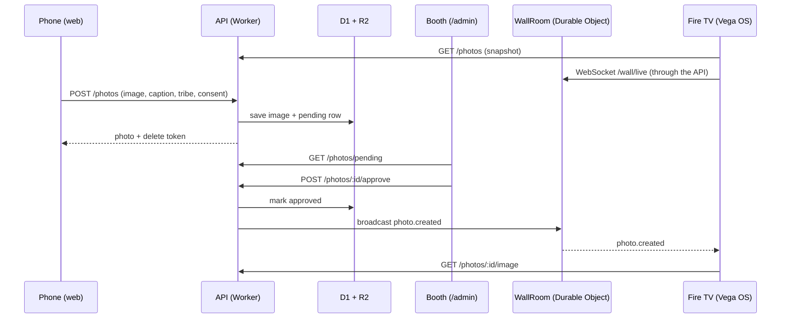

# Architecture notes

These are the decisions behind Live Wall that aren't obvious from the code, and why I made them. The README covers what the project does and how to run it.

## The shape of it



Three apps share one package, `packages/shared`, which holds the zod schemas for everything that crosses the network: photos, wall stats, the upload result and the realtime events. The API validates what comes in, and the TV and phone validate what comes back. If the contract changes, TypeScript and the parsers catch it on all three sides.

One upload, end to end:



## Repo layout

```
apps/
  tv/         Fire TV app (React Native for Vega)
    src/app/               App root and app.config.ts (API URLs, simulation)
    src/features/wall/     the wall: screens/, components/{collage,overlays,panels,primitives},
                           hooks/, data/, state/, constants/, utils/
  web/        phone capture page and the hidden /admin page
    src/features/{capture,admin}/   pages/, components/, hooks/, data/, constants/
  api/        Hono API, D1 schema and migrations, WallRoom Durable Object, retention cron
    src/modules/{photo,auth,wall}/  http/, domain/, data/, realtime/
packages/
  shared/     zod contracts and constants used by all three apps
  tsconfig/   shared TypeScript config
scripts/
  link-cf-delegates.mjs  postinstall workaround for the cf beta (see below)
  booth-remote.mjs       laptop remote for the booth (`pnpm remote`)
docs/
  architecture.md        design notes and the reasons behind them
```

## pnpm with a hoisted node_modules

pnpm normally gives every package its own isolated `node_modules` made of symlinks. Metro, React Native autolinking and the Vega build tools don't cope well with that. They expect packages to sit in a flat tree the way npm lays them out. Rather than fight that with resolver hacks, `.npmrc` sets `node-linker=hoisted`.

What you lose is pnpm's strictness about undeclared dependencies. ESLint, TypeScript and keeping each app's `package.json` honest have to cover that instead.

`apps/tv/metro.config.js` adds the workspace `packages/` folder and the root `node_modules` to Metro's watch and resolve paths, so the TV app can import `@vegaos-demo/shared` as raw TypeScript without a build step.

## zod v4 in React Native needs one Babel plugin

zod v4 ships `export * as ns from "..."` syntax. The React Native Babel preset doesn't transform it, and Metro fails to bundle the shared package. `apps/tv/babel.config.js` adds `@babel/plugin-transform-export-namespace-from` to fix that. It's one line, but it took a while to find.

## A 960×540 layout canvas on the TV

Vega lays out a 1080p screen at 2x, so the app works in a 960×540 dp coordinate space. The wall is a fixed composition rather than a responsive layout. Eleven polaroid slots with hand-picked positions and tilts, a side panel with the QR code and tribe battle, and a "now showing" bar along the bottom. All of it is defined in `apps/tv/src/features/wall/constants/layout.ts`, and the colours and spacing in `apps/tv/src/theme/tokens.ts`.

A TV is a known, fixed screen, so absolute positions read better than a flex layout trying to be clever. It also keeps the number of animated views small enough for a Fire TV Stick.

## Tests on the TV: logic, not rendering

The interesting TV logic lives in two plain reducers, and that's what the Jest tests cover:

- `state/wallState.ts` decides which photo goes into which slot, how a full wall makes room for a new arrival, and how a removed photo's slot gets refilled.
- `state/wallDirector.ts` decides what the wall does next: which slot is selected, when the spotlight opens and closes, and how a live arrival gets its turn. It takes explicit events (`advance`, `autoOpen`, `arrival`, `move`, `toggleSpotlight`, `closeSpotlight`, `togglePause`, `selectionEmptied`) and never touches a timer.

`hooks/useWallDirector.ts` owns the timers (7 s auto-advance, 1.5 s hurry when an arrival is waiting, 20 s auto-open, 4.5 s rotation) and turns them into events. Timer callbacks read the latest slots from a ref, so a photo rotating in doesn't restart the countdown that the progress line is showing.

I didn't add render tests for the screen. The Vega Jest preset mocks `Dimensions` with a phone-sized window and an `addEventListener` that returns nothing, so anything using `useWindowDimensions` breaks when it unsubscribes. You can patch around that, but the fixed 960×540 canvas meant the components never needed window dimensions anyway, and testing the reducer gives more confidence per line than snapshotting styled views.

## Realtime with a hibernating Durable Object

Every TV opens a WebSocket to `/wall/live`. The Worker forwards it to a single Durable Object, `WallRoom`, which accepts it with the hibernation API (`ctx.acceptWebSocket`). When the API approves or removes a photo, it calls `broadcast()` on the room over RPC, and the room sends the event to every socket.

Hibernation matters because the wall is idle most of the time. A connected TV costs nothing while nothing happens. The TV sends `ping` every 25 seconds to keep the connection alive through proxies, and the room answers with `setWebSocketAutoResponse("ping" → "pong")`. That reply comes from the runtime without waking the object up.

The TV treats the socket as a hint, not the source of truth. On every (re)connect it fetches a fresh snapshot over HTTP, so a missed event during a reconnect can't leave the wall out of date. Reconnects back off exponentially up to 15 seconds.

## Approve first, then broadcast

Uploads land as `pending` and are never broadcast. Only the admin `approve` call broadcasts `photo.created`. This is the one rule I wasn't willing to bend for a public screen at a busy event. The cost is a person at the booth, but no filter is as good as one, and it keeps the code simple: no moderation service, no takedown race.

Other privacy choices follow the same idea of keeping as little as possible:

- The phone downsizes images to about 1080px JPEG before upload. That's plenty for a TV, kind to conference Wi-Fi, and drops most of the original EXIF data.
- IPs (IPv6 by /64) are hashed with the current UTC date as salt and used only to rate-limit uploads and admin logins. The limits and the other abuse protections are listed in the README.
- Uploaders get a random delete token. Only its SHA-256 hash is stored.
- A cron trigger (`17 3 * * *`) hard-deletes rows and images past the retention window.

## API module layout

Each API module is grouped by layer, and requests flow http → domain → data:

```
modules/photo/
  index.ts      the module's public surface; other code imports only from here
  http/         photo.routes.ts, photo.schemas.ts
  domain/       photo.service.ts (+ test), photo.errors.ts, photo.types.ts, photo.formatters.ts
  data/         photo.repo.ts (D1), photo-storage.repo.ts (R2)
modules/auth/
  index.ts
  http/         admin.ts (isAdmin / requireAdmin for the routes)
  domain/       admin-guard.service.ts (+ test), auth.errors.ts (passcode lockout)
  data/         auth-failure.repo.ts (D1)
modules/wall/
  index.ts
  http/         wall.routes.ts (WebSocket upgrade, phone remote)
  domain/       wall.service.ts (broadcast to the room)
  realtime/     wall.room.ts (the WallRoom Durable Object)
```

- `http/` parses input with zod and checks admin auth. Nothing else knows about Hono.
- `domain/` holds the rules (rate limits, real-image checks, approval, who may delete).

Shared plumbing lives in `core/`, grouped by role: `runtime/` (Worker bindings), `http/` (context, responses, errors) and `security/` (hashing, HMAC, client keys).

- `data/` is the only place that talks to D1 and R2; `realtime/` is the only place that holds sockets.

Dependencies (`db`, `bucket`, the wall broadcaster, a clock) are passed into the service per request. That's what makes `photo.service.test.ts` possible without a Worker runtime: the repos are spied on and the clock is fixed.

Errors are `ServiceError`s with a stable `code` that the phone maps to friendly messages. Config is read and validated once in `config/env.ts`.

## Frontend feature layout

The TV and phone apps use the same rule as the API: every file lives in a named folder, and
only a feature's `index.ts` sits at its root.

```
apps/tv/src/features/wall/
  index.ts
  screens/      WallScreen.tsx (composition only)
  components/
    collage/    WallCollage, FloatingSlot, SelectedPhoto, PolaroidCard, EmptyWall
    overlays/   Spotlight, SpotlightCards, NowShowingBar, IncomingToast, ConnectingOverlay,
                ExitHint
    panels/     TopBar, JoinPanel, SourceCard, DemoChip, StatusPill, YearMark
    primitives/ QrCode, PopNumber, ProgressLine, SelectCatcher
  hooks/        useWallFeed, useWallDirector, useWallRemote, useRemoteControl,
                useSpotlightTransition
  data/         fetchWall, simulatedFeed
  state/        wallState, wallDirector, connectionPhase (+ tests)
  constants/    copy, layout, timing, feed
  utils/        formatRelative

apps/web/src/features/{capture,admin}/
  index.ts
  pages/        CapturePage (+ test) / AdminPage
  components/   feature-only UI
  hooks/  data/  constants/
```

Imports that cross folders go through the `@/` alias for `src/` in all three apps (Babel
`module-resolver` and a Jest mapper on the TV, Vite and Vitest aliases on the web and API).
Only files in the same folder import each other with `./`.

App-wide pieces sit next to `features/`: `app/` (root component and config), `components/`
grouped by purpose (`layout/`, `ui/`, `brand/` on the web), `theme/`, `assets/{brand,icons}/`.

## Smooth wall motion on Vega

A few rules came out of chasing flicker on the Virtual Device:

- Cards never change `zIndex`. Reordering native views made images blink, so the selected
  photo is drawn as a lifted copy in its own top layer (`SelectedPhoto`) while the card
  underneath fades out.
- A card that is leaving keeps its component instance (derived during render, not in an
  effect), so it fades with its image already decoded instead of remounting blank.
- Animated nodes are built once per card with `useMemo`, image sources are memoized, and
  only `transform` and `opacity` animate, all on the native driver.
- A card never waits forever for its image: it reveals after 2.5 s or shows a placeholder.
- The spotlight is a shared-element style zoom. One `progress` value (0 to 1) drives the
  backdrop, the details column and the card. At 0 the full-size card is translated, rotated
  and scaled so it sits exactly on its wall slot; at 1 it is centred. Closing runs the same
  value back to 0 and the overlay only unmounts when that animation finishes, so the last
  photo shrinks back into the wall. When the photo changes while it's open, the outgoing card
  stays mounted and fades out while the new one fades in; the backdrop doesn't move. The wall
  card underneath never changes `zIndex`, the spotlight just draws over it.

## The cf CLI beta workaround

Deploys use the new `cf` CLI and a typed `cloudflare.config.ts` per Worker instead of `wrangler.toml`. The beta has one rough edge: it looks for `@cloudflare/vite-plugin` only in the app's own `node_modules`, while the hoisted install puts it at the repo root.

`scripts/link-cf-delegates.mjs` runs on `postinstall` and symlinks the plugin into `apps/api/node_modules` and `apps/web/node_modules` for any app that declares it. Once the CLI resolves packages the normal Node way, the script can go.

## The phone page

The web app has two screens, so it switches on `location.pathname` instead of pulling in a router. `/admin` isn't linked anywhere and is locked with the passcode. The passcode is kept in `sessionStorage` only, so it's gone when the tab closes.

Styling uses Tailwind v4 with a small token layer. `theme/themes/devcon.css` is the only file with literal colours, and `theme/theme.css` maps Tailwind's theme onto those variables. The Worker serves the built assets with single-page-app fallback and has no server code.

## Abuse protection

A public upload endpoint is an invitation, so the API assumes someone will try:

- **Limits.** Venue Wi-Fi puts hundreds of people behind one IP, so the per-client limits only stop scripts: 60 uploads per 10 minutes and 500 per day, counting an IPv6 client by its /64 so it can't rotate addresses. Globally: at most 300 photos waiting for approval and 5,000 uploads per day. Once those are hit, everyone gets "try again later", so storage and cost stay bounded however many IPs someone has.
- **Real images only.** The request size is checked before the body is read, and the file type comes from the file's first bytes, not from what the browser claims. Images are served with `nosniff`, a `sandbox` content security policy and their checked type, so nothing uploaded can run.
- **Not a free image host.** Pending photos aren't public: the admin page gets signed links to them. Approved photos carry `Cross-Origin-Resource-Policy: same-site`, and requests from other sites' pages are refused, so they can't be embedded elsewhere.
- **Admin passcode lockout.** 10 wrong passcodes in 15 minutes lock that client out for the window.
- **Capped sockets.** The wall's Durable Object accepts at most 50 screens.

Schema changes follow the usual Drizzle flow: edit `apps/api/src/db/schema.ts`, run `pnpm --filter @vegaos-demo/api db:generate`, then apply the new migration.

## Things I'd change for a real product

- A room per event or per screen, picked by id, instead of one global room.
- Real admin accounts instead of a shared passcode.
- Push the pending queue to the admin page over the same WebSocket instead of polling.
- Automated image screening to help, not replace, the human at the booth.
