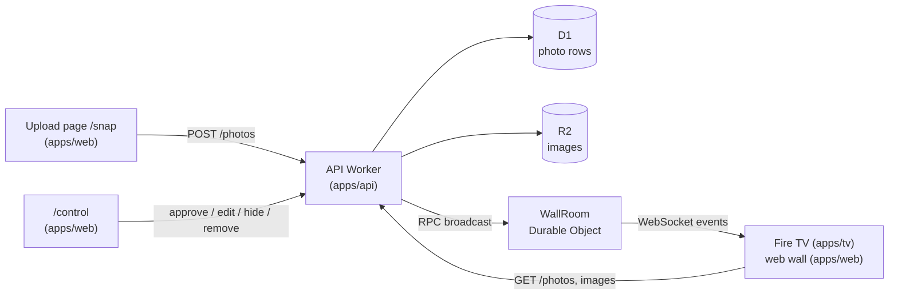

# Architecture notes

The decisions behind BoothWall that aren't obvious from the code, and why I made them. The README covers what it does and how to run it.

## The shape of it



Three apps share one package, `packages/shared`, which holds the zod schemas for everything that crosses the network: photos, wall stats, the upload result, the realtime events and the Control panel's list, edit and stats contracts. The API validates what comes in, and the TV and the web app validate what comes back. If the contract changes, TypeScript and the parsers catch it on all three sides.

1. A visitor scans the QR code and opens `/snap`.
2. They take a photo, add a caption, pick a category and agree to it being shown. The phone shrinks it to 1080 px, makes a 480 px thumbnail and uploads both.
3. The API stores it in R2 with a `pending` row in D1. Nothing reaches a screen yet.
4. Someone at the booth approves it in `/control`.
5. The API tells the Durable Object, which pushes it to every connected wall over a WebSocket.
6. The TV and every browser showing the wall drop the new polaroid in and give it a moment full screen.

The same flow as a diagram:


## Repo layout

```
apps/
  tv/         Fire TV app (React Native for Vega): a thin shell around packages/wall-ui
    src/app/               App root
    src/platform/          Vega adapters (the TV remote)
  web/        the wall at / (a feed on phones), the upload page at /snap and /control
    src/app/               routes.ts (pathname → screen, old addresses)
    src/features/{capture,control,wall}/   pages/, components/, hooks/, data/, constants/
    vite/plugins/          applies the config to index.html, CSS variables and _redirects
  api/        Hono API, D1 schema and migrations, WallRoom Durable Object, retention cron
    src/modules/{photo,auth,wall}/  http/, domain/, data/, realtime/
packages/
  shared/     the BoothWall config, zod contracts and colour helpers used by all three apps
  wall-ui/    the wall itself, for Vega and the web
    src/app/               app.config.ts (derived from the BoothWall config)
    src/assets/brand/      logo and backdrop (replace to rebrand)
    src/features/wall/     screens/, components/{collage,overlays,panels,primitives},
                           hooks/, data/, state/, constants/, utils/
    src/theme/             tokens.ts
  tsconfig/   shared TypeScript config
brand/        SVG sources of the default artwork
examples/     complete setups that mirror the repo layout (next.app devCon 2026)
scripts/
  boothwall/  the `pnpm boothwall` CLI: setup, deploy, migrate, example
  remote/     laptop remote for the booth (`pnpm remote`)
  postinstall/  workaround for the cf beta (see below)
docs/         these notes, customising and the Vega OS field notes
```

## One config, three apps

`packages/shared/src/config/boothwall.config.ts` is the only file a deployer edits. It has to work in four places, which explains its shape:

- **The TV (Metro) and the web app (Vite)** import it through `@boothwall/shared`. The package's entry point validates it against the zod schema, so a broken config fails every build.
- **The `cf` CLI** loads each app's `cloudflare.config.ts` with plain Node, which strips TypeScript types but can't follow extension-less imports. So the config file is pure data with a type-only import, and the Cloudflare configs import it by its `.ts` path.
- **The `pnpm boothwall` CLI** reads it the same way and writes setup results (D1 id, URLs, `demo`) back into it with small, layout-preserving edits.

The committed config runs the public demo, so a fresh clone shows a real wall straight away. That also means a clone carries someone else's database id. Setup and deploy check the id against the logged-in account with `d1 list`: setup drops a foreign id and creates a database, and stops if the demo's custom domains are still set, since they're on a zone the account doesn't own.

Brand colours become wall tokens in `packages/wall-ui/src/theme/tokens.ts` and CSS variables injected by the Vite plugin. `readableOn` shades a colour used as text just enough to reach a 3:1 contrast, so any palette stays legible.

## pnpm with a hoisted node_modules

pnpm normally gives every package its own isolated `node_modules` made of symlinks. Metro, React Native autolinking and the Vega build tools don't cope well with that. They expect packages to sit in a flat tree the way npm lays them out. Rather than fight that with resolver hacks, `.npmrc` sets `node-linker=hoisted`.

What you lose is pnpm's strictness about undeclared dependencies. ESLint, TypeScript and keeping each app's `package.json` honest have to cover that instead.

`apps/tv/metro.config.js` adds the workspace `packages/` folder and the root `node_modules` to Metro's watch and resolve paths, so the TV app can import `@boothwall/shared` and `@boothwall/wall-ui` as raw TypeScript without a build step.

The shared package uses zod v4, which needs one extra Babel plugin on React Native; see the [Vega OS notes](vega-os-notes.md#rendering-and-animation).

## A 960×540 layout canvas on the TV

Vega lays out a 1080p screen at 2x, so the app works in a 960×540 dp coordinate space. The wall is a fixed composition rather than a responsive layout. Eleven polaroid slots with hand-picked positions and tilts, a side panel with the QR code and the category counts, and a "now showing" bar along the bottom. All of it is defined in `packages/wall-ui/src/features/wall/constants/layout.ts`, and the colours and spacing in `packages/wall-ui/src/theme/tokens.ts`.

A TV is a known, fixed screen, so absolute positions read better than a flex layout trying to be clever. It also keeps the number of animated views small enough for a Fire TV Stick.

## Tests on the wall: logic, not rendering

The interesting wall logic lives in two plain reducers, and that's what the Jest tests in `packages/wall-ui` cover. They run on React Native's own Jest preset, so nothing Vega-specific is needed to test the package:

- `state/wallState.ts` decides which photo goes into which slot, how a full wall makes room for a new arrival, and how a removed photo's slot gets refilled.
- `state/wallDirector.ts` decides what the wall does next: which slot is selected, when the spotlight opens and closes, and how a live arrival gets its turn. It takes explicit events (`advance`, `autoOpen`, `arrival`, `move`, `toggleSpotlight`, `closeSpotlight`, `togglePause`, `selectionEmptied`) and never touches a timer.

`hooks/useWallDirector.ts` owns the timers (7 s auto-advance, 1.5 s hurry when an arrival is waiting, 20 s auto-open, 4.5 s rotation) and turns them into events. Timer callbacks read the latest slots from a ref, so a photo rotating in doesn't restart the countdown that the progress line is showing.

I didn't add render tests for the TV screen. Vega's Jest preset has a broken `Dimensions` mock ([notes](vega-os-notes.md#debugging)), and with a fixed 960×540 canvas, testing the reducers gives more confidence per line than snapshotting styled views.

On the web, `WallPage.test.tsx` (Vitest and jsdom) renders the whole wall through react-native-web in demo mode, which catches a platform API the browser lacks, and checks that a phone held upright gets the feed. The feed's event handling and the routes have small unit tests of their own.

## Realtime with a hibernating Durable Object

Every screen, TV or browser, opens a WebSocket to `/wall/live`. The Worker forwards it to a single Durable Object, `WallRoom`, which accepts it with the hibernation API (`ctx.acceptWebSocket`). When the API approves or removes a photo, it calls `broadcast()` on the room over RPC, and the room sends the event to every socket.

Hibernation matters because the wall is idle most of the time. A connected TV costs nothing while nothing happens. The TV sends `ping` every 25 seconds to keep the connection alive through proxies, and the room answers with `setWebSocketAutoResponse("ping" → "pong")`. That reply comes from the runtime without waking the object up.

The TV treats the socket as a hint, not the source of truth. On every (re)connect it fetches a fresh snapshot over HTTP, so a missed event during a reconnect can't leave the wall out of date. Reconnects back off exponentially up to 15 seconds.

## Approve first, then broadcast

Uploads land as `pending` and are never broadcast. Only approving in the Control panel broadcasts `photo.created`. This is the one rule I wasn't willing to bend for a public screen at a busy event. The cost is a person at the booth, but no filter is as good as one, and it keeps the code simple: no moderation service, no takedown race.

Other privacy choices follow the same idea of keeping as little as possible:

- The phone downsizes images to about 1080 px JPEG before upload, plus a 480 px thumbnail for the wall cards. That's plenty for a TV, kind to conference Wi-Fi, and drops most of the original EXIF data.
- IPs (IPv6 by /64) are hashed with the current UTC date as salt and used only to rate-limit uploads and admin logins. The limits and the other abuse protections are under [Abuse protection](#abuse-protection).
- Uploaders get a random delete token. Only its SHA-256 hash is stored.
- A cron trigger (`17 3 * * *`) hard-deletes rows and images past the retention window, except photos marked `keep`. That flag is for a demo wall's starter photos; it's set through `PATCH /photos/:id` and has no button in the Control panel.

## The Control panel

`/control` is the booth's page, four tabs on a phone: Queue (approve or reject), Photos (manage everything), Remote and Overview. Everything it calls needs the passcode, checked by `requireAdmin` or, on the newer routes, an `adminOnly` middleware that runs before any input is parsed. Ten wrong passcodes in 15 minutes lock a client out.

| Endpoint             | What it does                                                                                      |
| -------------------- | ------------------------------------------------------------------------------------------------- |
| `GET /photos/manage` | Every kept photo. Filters `status`, `tribe`, `q` (caption search); `sort`; `cursor`; `limit` ≤ 50 |
| `PATCH /photos/:id`  | Edits `caption`, `tribe`, `hidden` and `keep`; any subset, at least one                           |
| `GET /photos/stats`  | On the wall, pending, hidden, uploads since `since`, and the same per category                    |

A note on names: what the config and the UI call a category is stored and sent as `tribe` (the column, the API field, `TRIBES`). That's the name from the first version, and renaming it would break the API that installed TV builds already use.

A photo has three statuses: `pending`, `approved` and `hidden`. Hiding keeps the row and the image but treats them like a pending photo: off the public wall endpoint, and the image only through a signed link. Showing a hidden photo approves it. Every photo the Control panel lists that isn't on the wall comes with signed image and thumbnail links (the same HMAC as pending photos).

The wall follows every change live:

| Change                        | Event           |
| ----------------------------- | --------------- |
| Approve, or show a hidden one | `photo.created` |
| Hide or delete                | `photo.removed` |
| New caption or category       | `photo.updated` |

`photo.updated` carries the whole photo and fresh stats. The wall reducer swaps it into the pool in place, so the card keeps its slot and doesn't get the new-arrival treatment. Edits to photos that aren't on the wall send nothing.

The list pages with keyset cursors, not offsets, so photos arriving at the booth don't shift pages under someone scrolling. A cursor is the last row's sort keys (category position, `created_at`, `id`) encoded with the sort it belongs to; one from another sort is refused. Sorting by category follows the config's order, through a `CASE` expression, and a `(tribe, created_at)` index backs the category filter.

On the page, hide, show, approve and edits are optimistic and roll back with a toast if the API says no. Deletes wait for the API, since they can't be undone. Bulk actions run one photo at a time with a progress bar, and stop at the first failure.

## API module layout

Each API module is grouped by layer, and requests flow http → domain → data:

```
modules/photo/
  index.ts      the module's public surface; other code imports only from here
  http/         photo.routes.ts, photo.schemas.ts
  domain/       photo.service.ts (+ test), photo.errors.ts, photo.types.ts, photo.formatters.ts,
                photo.cursor.ts (list cursors)
  data/         photo.repo.ts (D1), photo-storage.repo.ts (R2)
modules/auth/
  index.ts
  http/         admin.middleware.ts (isAdmin / requireAdmin / adminOnly for the routes)
  domain/       admin-guard.service.ts (+ test), auth.errors.ts (passcode lockout)
  data/         auth-failure.repo.ts (D1)
modules/wall/
  index.ts
  http/         wall.routes.ts (WebSocket upgrade, the Control panel's remote)
  domain/       wall.service.ts (broadcast to the room)
  realtime/     wall.room.ts (the WallRoom Durable Object)
```

- `http/` parses input with zod and checks admin auth. Nothing else knows about Hono.
- `domain/` holds the rules (rate limits, real-image checks, approval, who may delete).
- `data/` is the only place that talks to D1 and R2; `realtime/` is the only place that holds sockets.

The Hono app itself, with its middleware and error handler, is in `app/app.ts`; `index.ts` only wires it to the Worker and the cron. Shared plumbing lives in `core/`, grouped by role: `runtime/` (Worker bindings), `http/` (context, responses, errors, the client IP) and `security/` (hashing, HMAC, client keys).

Dependencies (`db`, `bucket`, the wall broadcaster, a clock) are passed into the service per request. That's what makes `photo.service.test.ts` possible without a Worker runtime: the repos are spied on and the clock is fixed.

Errors are `ServiceError`s with a stable `code` that the web app maps to friendly messages. Config is read and validated once in `config/env.ts`.

## One wall, two platforms

The wall is `packages/wall-ui`. The TV app renders it through React Native for Vega and the web app renders it at `/` through react-native-web, so the screens, components, hooks, state and tokens are one copy. The package imports only `react-native`; an ESLint `no-restricted-imports` rule fails the build if anything from `@amazon-devices/*` gets in.

| Piece     | Vega (`apps/tv`)                                      | Web (`apps/web`)                                                              |
| --------- | ----------------------------------------------------- | ----------------------------------------------------------------------------- |
| Remote    | `useTVEventHandler` (`src/platform/useVegaRemote.ts`) | Arrow keys, Enter, Space, Escape (`features/wall/hooks/useKeyboardRemote.ts`) |
| Back      | `BackHandler`; a second Back on the wall exits        | Escape closes the spotlight; a web page can't exit                            |
| Images    | Metro asset ids                                       | Vite asset URLs                                                               |
| Animation | Native driver                                         | JavaScript driver                                                             |
| Canvas    | 960×540 dp, drawn at 2× on 1080p                      | 960×540, scaled to the window; a feed on phones held upright                  |

What differs per platform goes through one of two seams:

- **Adapters passed in by the app.** `WallScreen` takes `useRemoteInput`, a hook that calls the wall's handlers once per button press. The TV passes `useVegaRemote` (`useTVEventHandler`, key up only); the web passes `useKeyboardRemote` (arrows, Enter, Space, Escape or Backspace for Back). The remote needs a Vega-only API, so it can't live in the package.
- **`.web.ts` twins inside the package.** Where both platforms use plain React Native APIs but need different behaviour, a `foo.web.ts` sits next to `foo.ts`. Vite lists `.web.*` first in `resolve.extensions` and the web `tsconfig` sets `moduleSuffixes`, so the browser build and its typecheck use the twin; Metro and Jest never see it. There are three: `hooks/useBackButton` (`BackHandler` and `exitApp` on Vega, nothing on the web), `utils/bundledImage` (Metro asset ids versus Vite asset URLs, and the logo's aspect ratio, which Metro knows at build time and the browser only after loading) and `constants/motion` (the native driver on Vega, the JavaScript driver on the web, which has no native one).

Everything else (`AppState`, `Image.prefetch`, `WebSocket`, `ImageBackground`, `Pressable`) works on both as is.

The web side lives in `apps/web/src/features/wall`. The page scales the 960×540 canvas with one CSS transform to fit the window, letterboxed at 16:9, and runs live or in demo mode as the config says, like the TV (`?demo` forces the demo). `vite/plugins/reactNativeWeb.ts` aliases `react-native` to `react-native-web`, prefers `.web.*` files and defines `global`, which React Native's `Animated` still reads. The route is lazy-loaded, so React Native for Web and the demo photos never reach the upload page bundle.

A phone held upright gets a different page on `/`: `components/phone/PhoneWall` shows the photos newest first, the category counts and the upload button. The 16:9 canvas would be a thin strip there. It's plain React and Tailwind, not the shared wall, and keeps itself current with `useLiveWall`: the same snapshot endpoint and socket as the TV, folded together by `data/applyWallEvent.ts`. Turning the phone sideways brings back the canvas.

Around the canvas, two copies of the backdrop fill the window: a blurred one covering it and a sharp one exactly behind the canvas. The canvas edge fades into identical pixels, so a window that isn't 16:9 shows no seam.

Two things I ran into:

- **No `StrictMode` on the wall.** Its dev-only double mount detaches and reattaches every animated view, and react-native-web stops a running animation when its value loses its last view. The spotlight never opened in `pnpm web:dev`. The TV app doesn't use `StrictMode` either, so the web app now wraps only the upload page and the Control panel in it.
- **Imports inside the package are relative.** `@/` means each app's own `src/`, and both apps compile the package from source, so an alias there would point into the wrong app.

## Frontend feature layout

The TV, web and wall code use the same rule as the API: every file lives in a named folder, and only a feature's `index.ts` sits at its root.

```
packages/wall-ui/src/features/wall/
  index.ts
  screens/      WallScreen.tsx (composition only)
  components/
    collage/    WallCollage, FloatingSlot, SelectedPhoto, PolaroidCard, EmptyWall
    overlays/   Spotlight, SpotlightCards, NowShowingBar, IncomingToast, ConnectingOverlay,
                ExitHint
    panels/     TopBar, JoinPanel, SourceCard, DemoChip, StatusPill, YearMark
    primitives/ QrCode, PopNumber, ProgressLine, SelectCatcher
  hooks/        useWallFeed, useWallDirector, useWallRemote, useBackButton (+ .web),
                useSpotlightTransition
  data/         fetchWall, simulatedFeed, demoPhotos, prefetchImage
  state/        wallState, wallDirector, connectionPhase (+ tests)
  constants/    copy, layout, timing, feed, motion (+ .web)
  utils/        formatRelative, bundledImage (+ .web)

apps/web/src/features/{capture,control,wall}/
  index.ts
  pages/        CapturePage (+ test) / ControlPage (+ test) / WallPage (+ test)
  components/   feature-only UI, grouped by screen: compose/ and success/ for the upload
                page; shell/, queue/, photos/, overview/ and remote/ for the Control panel;
                canvas/, phone/ and shared/ for the wall
  hooks/  data/  constants/
```

Imports that cross folders go through the `@/` alias for `src/` in all three apps (Babel
`module-resolver` on the TV, Vite and Vitest aliases on the web and API). Only files in the same folder import each other with `./`. `packages/wall-ui` is the exception: its imports are relative (see above).

App-wide pieces sit next to `features/`: `app/` (root component and config), `components/` grouped by purpose (`layout/`, `ui/`, `brand/` on the web), `theme/`, `assets/{brand,icons}/`, and `platform/` for the TV's Vega adapters.

## Smooth wall motion on Vega

The rules that came out of chasing flicker (fixed z-order, no remounting a card to animate it out, Animated nodes built once) are in the [Vega OS notes](vega-os-notes.md#rendering-and-animation). Two more things the wall does:

- A card never waits forever for its image: it reveals after 2.5 s or shows a placeholder.
- The spotlight is a shared-element style zoom. One `progress` value (0 to 1) drives the backdrop, the details column and the card. At 0 the full-size card is translated, rotated and scaled so it sits exactly on its wall slot; at 1 it is centred. Closing runs the same value back to 0, and the overlay only unmounts when that finishes, so the last photo shrinks back into the wall. When the photo changes while it's open, the outgoing card fades out while the new one fades in, and the backdrop doesn't move.

## The cf CLI beta workaround

Deploys use the new `cf` CLI and a typed `cloudflare.config.ts` per Worker instead of `wrangler.toml`. The beta has one rough edge: it looks for `@cloudflare/vite-plugin` only in the app's own `node_modules`, while the hoisted install puts it at the repo root.

`scripts/postinstall/link-cf-delegates.mjs` runs on `postinstall` and symlinks the plugin into `apps/api/node_modules` and `apps/web/node_modules` for any app that declares it. Once the CLI resolves packages the normal Node way, the script can go.

## The web app

The web app has three screens (the wall at `/`, the upload page at `/snap` and `/control`), so `app/routes.ts` switches on `location.pathname` instead of pulling in a router. Matching ignores case: the TV's QR code is upper case, which keeps it small and easy to scan, so phones arrive at `/SNAP`. The TV's QR code points to `/snap`; on a phone the wall shows an "Add your photo" button that goes there too. `/control` isn't linked anywhere and is locked with the passcode. Old addresses still work: `/admin` goes to `/control` and `/wall` to `/`, on the server through `_redirects` and in the app for `pnpm web:dev`. The passcode is kept in `sessionStorage` only, so it's gone when the tab closes.

Styling uses Tailwind v4 with a small token layer. `theme/themes/boothwall.css` holds the neutral colours, fonts and radii; the brand colours come from `boothwall.config.ts` and are inlined as CSS variables by `vite/plugins/boothwall.ts`, which also fills in the event name and the `/gh` short link. `theme/theme.css` maps Tailwind's theme onto those variables. The Worker serves the built assets with single-page-app fallback and has no server code.

## Abuse protection

A public upload endpoint is an invitation, so the API assumes someone will try:

- **Limits.** Venue Wi-Fi puts hundreds of people behind one IP, so the per-client limits only stop scripts: 60 uploads per 10 minutes and 500 per day, counting an IPv6 client by its /64 so it can't rotate addresses. Globally: at most 300 photos waiting for approval and 5,000 uploads per day. Once those are hit, everyone gets "try again later", so storage and cost stay bounded however many IPs someone has.
- **Real images only.** The request size is checked before the body is read, and the file type comes from the file's first bytes, not from what the browser claims. Images are served with `nosniff`, a `sandbox` content security policy and their checked type, so nothing uploaded can run.
- **Not a free image host.** Pending and hidden photos aren't public: the Control panel gets signed links to them. Approved photos are refused to other sites' pages, judged by `Referer` and `Sec-Fetch-Site`, so they can't be embedded elsewhere. They do carry `Cross-Origin-Resource-Policy: cross-origin`, because Vega's image loader enforces CORP and the TV app has no origin of its own.
- **Admin passcode lockout.** 10 wrong passcodes in 15 minutes lock that client out for the window.
- **Capped sockets.** The wall's Durable Object accepts at most 50 screens.

## Things I'd change for a real product

- A room per event or per screen, picked by id, instead of one global room.
- Real admin accounts instead of a shared passcode.
- Push the pending queue to the Control panel over the same WebSocket instead of polling.
- Automated image screening to help, not replace, the human at the booth.
